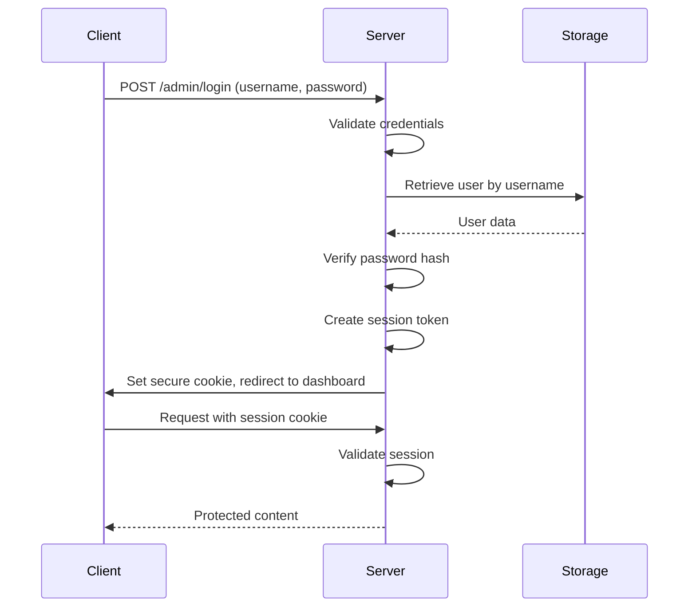

# Dining Hall Dashboard - System Architecture Design

## 📋 Overview

The Dining Hall Dashboard is a Rust-based web application built using the Actix-web framework. It provides a comprehensive solution for managing dining hall menu items, site notices, and automated scheduling with a secure admin authentication system.

## 📦 Dependencies

### Core Dependencies

- **actix-web** = "4.11.0" - Web framework for Rust
- **serde** = { version = "1.0.219", features = ["derive"] } - Serialization framework
- **tera** = "1.20.0" - Template engine
- **argon2** = "0.5.3" - Password hashing algorithm
- **serde_json** = "1.0.108" - JSON support for serde
- **chrono** = { version = "0.4.31", features = ["serde"] } - Date and time library
- **uuid** = { version = "1.7.0", features = ["serde", "v4"] } - UUID generation
- **actix-session** = "0.8.0" - Session management for Actix-web
- **rand** = "0.8.5" - Random number generation

### Development Dependencies

- **actix-rt** = "2.9.0" - Actix runtime
- **actix-files** = "0.6.6" - Static file serving
- **env_logger** = "0.10.1" - Logging implementation
- **actix-cors** = "0.7.1" - CORS support
- **tokio** = { version = "1.0", features = ["full"] } - Asynchronous runtime
- **log** = "0.4" - Logging facade

## 🗃️ Data Models

### MenuItem

```rust
#[derive(Debug, Serialize, Deserialize, Clone)]
pub struct MenuItem {
    pub id: Uuid,
    pub name: String,
    pub category: MenuCategory,
    pub description: String,
    pub price: f64,
    pub allergens: Vec<String>,
    pub is_available: bool,
}
```

### MenuCategory

```rust
#[derive(Debug, Serialize, Deserialize, Clone)]
pub enum MenuCategory {
    Mains,
    Sides,
    Desserts,
    Beverages,
}
```

### Notice

```rust
#[derive(Debug, Serialize, Deserialize, Clone)]
pub struct Notice {
    pub id: Uuid,
    pub title: String,
    pub content: String,
    pub is_active: bool,
    pub created_at: DateTime<Utc>,
    pub updated_at: DateTime<Utc>,
}
```

### AdminUser

```rust
#[derive(Debug, Serialize, Deserialize)]
pub struct AdminUser {
    pub id: Uuid,
    pub username: String,
    pub password_hash: String,
}
```

### MenuPreset

```rust
#[derive(Debug, Serialize, Deserialize, Clone)]
pub struct MenuPreset {
    pub id: Uuid,
    pub name: String,
    pub description: String,
    pub menu_item_ids: Vec<Uuid>,
    pub created_at: DateTime<Utc>,
    pub updated_at: DateTime<Utc>,
}
```

### MenuSchedule

```rust
#[derive(Debug, Serialize, Deserialize, Clone)]
pub struct MenuSchedule {
    pub id: Uuid,
    pub preset_id: Uuid,
    pub name: String,
    pub description: String,
    pub start_time: DateTime<Utc>,
    pub end_time: DateTime<Utc>,
    pub recurrence: ScheduleRecurrence,
    pub status: ScheduleStatus,
    pub created_at: DateTime<Utc>,
    pub updated_at: DateTime<Utc>,
}
```

### ScheduleRecurrence

```rust
#[derive(Debug, Serialize, Deserialize, Clone)]
pub enum ScheduleRecurrence {
    Daily,
    Weekly,
    Monthly,
    Custom,
}
```

### ScheduleStatus

```rust
#[derive(Debug, Serialize, Deserialize, Clone)]
pub enum ScheduleStatus {
    Active,
    Inactive,
    Pending,
}
```

## 🗄️ JSON Storage System

### File Paths

- Menu items: `data/menu_items.json`
- Notices: `data/notices.json`
- Admin users: `data/admin_users.json`
- Menu presets: `data/menu_presets.json`
- Menu schedules: `data/menu_schedules.json`

### Storage Architecture Diagram

```
┌─────────────────────────────────────────────────────────────┐
│                    JsonStorage Layer                        │
├─────────────────────────────────────────────────────────────┤
│  ┌─────────────┐  ┌────────────┐  ┌──────────────┐         │
│  │ Menu Items  │  │  Notices   │  │ Admin Users  │         │
│  │   Mutex     │  │  Mutex     │  │   Mutex      │         │
│  └─────────────┘  └────────────┘  └──────────────┘         │
│  ┌─────────────┐  ┌────────────┐                          │
│  │Menu Presets │  │ Schedules  │                          │
│  │   Mutex     │  │  Mutex     │                          │
│  └─────────────┘  └────────────┘                          │
├─────────────────────────────────────────────────────────────┤
│                    File System Layer                        │
├─────────────────────────────────────────────────────────────┤
│  menu_items.json  notices.json  admin_users.json           │
│  menu_presets.json  menu_schedules.json                    │
└─────────────────────────────────────────────────────────────┘
```

### Storage Module Interface

```rust
pub struct JsonStorage {
    menu_items: Arc<Mutex<Vec<MenuItem>>>,
    notices: Arc<Mutex<Vec<Notice>>>,
    admin_users: Arc<Mutex<Vec<AdminUser>>>,
    menu_presets: Arc<Mutex<Vec<MenuPreset>>>,
    menu_schedules: Arc<Mutex<Vec<MenuSchedule>>>,
    // ... file paths
}

impl JsonStorage {
    pub fn new(
        menu_items_path: &str,
        notices_path: &str,
        admin_users_path: &str,
        menu_presets_path: &str,
        menu_schedules_path: &str,
    ) -> Result<Self, StorageError> {
        // Initialize and load data from files
    }

    pub fn save_menu_items(&self) -> Result<(), StorageError> {
        // Thread-safe save operation
    }

    pub fn get_menu_items(&self) -> Result<Vec<MenuItem>, StorageError> {
        // Thread-safe read operation
    }

    // Similar methods for other data types
}
```

## 🌐 API Endpoint Specifications

### Authentication Endpoints

| Method | Endpoint        | Description        | Status Codes             |
| ------ | --------------- | ------------------ | ------------------------ |
| `GET`  | `/admin/login`  | Display login page | 200 OK                   |
| `POST` | `/admin/login`  | Authenticate user  | 200 OK, 401 Unauthorized |
| `POST` | `/admin/logout` | End user session   | 200 OK                   |

### Menu Item Endpoints

| Method   | Endpoint          | Description          | Status Codes                  |
| -------- | ----------------- | -------------------- | ----------------------------- |
| `GET`    | `/api/items`      | List all menu items  | 200 OK                        |
| `POST`   | `/api/items`      | Create new menu item | 201 Created, 400 Bad Request  |
| `PUT`    | `/api/items/{id}` | Update menu item     | 200 OK, 404 Not Found         |
| `DELETE` | `/api/items/{id}` | Delete menu item     | 204 No Content, 404 Not Found |

### Notice Endpoints

| Method   | Endpoint            | Description       | Status Codes                  |
| -------- | ------------------- | ----------------- | ----------------------------- |
| `GET`    | `/api/notices`      | List all notices  | 200 OK                        |
| `POST`   | `/api/notices`      | Create new notice | 201 Created, 400 Bad Request  |
| `PUT`    | `/api/notices/{id}` | Update notice     | 200 OK, 404 Not Found         |
| `DELETE` | `/api/notices/{id}` | Delete notice     | 204 No Content, 404 Not Found |

### Menu Preset Endpoints

| Method   | Endpoint            | Description              | Status Codes                  |
| -------- | ------------------- | ------------------------ | ----------------------------- |
| `GET`    | `/api/presets`      | List all menu presets    | 200 OK                        |
| `POST`   | `/api/presets`      | Create new menu preset   | 201 Created, 400 Bad Request  |
| `GET`    | `/api/presets/{id}` | Get specific menu preset | 200 OK, 404 Not Found         |
| `PUT`    | `/api/presets/{id}` | Update menu preset       | 200 OK, 404 Not Found         |
| `DELETE` | `/api/presets/{id}` | Delete menu preset       | 204 No Content, 404 Not Found |

### Schedule Endpoints

| Method   | Endpoint                  | Description                  | Status Codes                  |
| -------- | ------------------------- | ---------------------------- | ----------------------------- |
| `GET`    | `/api/schedules`          | List all menu schedules      | 200 OK                        |
| `POST`   | `/api/schedules`          | Create new menu schedule     | 201 Created, 400 Bad Request  |
| `GET`    | `/api/schedules/{id}`     | Get specific menu schedule   | 200 OK, 404 Not Found         |
| `PUT`    | `/api/schedules/{id}`     | Update menu schedule         | 200 OK, 404 Not Found         |
| `DELETE` | `/api/schedules/{id}`     | Delete menu schedule         | 204 No Content, 404 Not Found |
| `GET`    | `/api/schedules/upcoming` | List upcoming schedules      | 200 OK                        |
| `POST`   | `/api/schedules/validate` | Validate schedule parameters | 200 OK                        |

## 🔐 Authentication System

### Session Management

The application uses cookie-based session management with the following security features:

- Secure cookies with HttpOnly and Secure flags
- CSRF protection tokens
- Argon2 password hashing with salt
- Session expiration after 24 hours

### Password Hashing

```rust
pub fn hash_password(password: &str) -> Result<String, AuthError> {
    let salt = SaltString::generate(&mut OsRng);
    let argon2 = Argon2::default();
    let password_hash = argon2
        .hash_password(password.as_bytes(), &salt)
        .map_err(|_| AuthError::HashError)?
        .to_string();
    Ok(password_hash)
}
```

### Authentication Flow Diagram



## 🖼️ Templating Structure

### Directory Structure

```
templates/
├── base.html
├── menu.html
├── admin/
│   ├── login.html
│   ├── dashboard.html
│   ├── presets.html
│   └── schedules.html
└── partials/
    ├── header.html
    └── footer.html
```

### Base Template

```html
<!DOCTYPE html>
<html lang="en">
  <head>
    <meta charset="UTF-8" />
    <meta name="viewport" content="width=device-width, initial-scale=1.0" />
    <title>Dining Hall Dashboard</title>
    <link rel="stylesheet" href="/static/css/style.css" />
  </head>
  <body>
    
    <main></main>
    
  </body>
</html>
```

## 🎨 Frontend Architecture

### Accessibility Features

- WCAG 2.1 AA compliance
- Semantic HTML structure
- ARIA labels for interactive elements
- Keyboard navigation support
- High color contrast ratios (4.5:1 minimum)
- Responsive design for mobile/desktop

### CSS Structure

- Mobile-first responsive design
- CSS Grid and Flexbox layouts
- CSS custom properties for theming
- Minimal JavaScript for enhanced functionality

### Color System

The application uses a carefully designed color system based on CSS custom properties:

| Purpose   | Color     | Hex Value |
| --------- | --------- | --------- |
| Primary   | Burgundy  | `#552130` |
| Secondary | Dark Blue | `#2a2d3c` |
| Accent    | Cream     | `#f0eee6` |
| Success   | Green     | `#2e7d32` |
| Warning   | Orange    | `#ef6c00` |
| Error     | Red       | `#c62828` |

## 📁 Project Structure

```
src/
├── main.rs          # Application entry point
├── auth.rs          # Authentication system
├── handlers.rs      # HTTP request handlers
├── storage.rs       # JSON storage system
└── scheduler.rs     # Automated scheduling system

data/
├── menu_items.json
├── notices.json
├── admin_users.json
├── menu_presets.json
└── menu_schedules.json

templates/
├── base.html
├── menu.html
├── admin/
│   ├── login.html
│   ├── dashboard.html
│   ├── presets.html
│   └── schedules.html
└── partials/
    ├── header.html
    └── footer.html

assets/
├── static/
│   ├── css/
│   ├── js/
│   └── images/
└── branding/
```

## ⏰ Scheduler System

### Architecture Overview

The scheduler system runs as a background task that periodically checks for due menu schedules and executes them automatically.

### Scheduler Flow Diagram

```
┌─────────────────────────────────────────────────────────────┐
│                    Scheduler Service                        │
├─────────────────────────────────────────────────────────────┤
│  ┌─────────────┐                                            │
│  │  Interval   │  Every minute                              │
│  │   Timer     │                                            │
│  └─────────────┘                                            │
│         │                                                   │
│         ▼                                                   │
│  ┌─────────────┐  Get all schedules                        │
│  │   Storage   │  from JSON files                          │
│  └─────────────┘                                            │
│         │                                                   │
│         ▼                                                   │
│  ┌─────────────┐  Check if schedule                        │
│  │  Schedule   │  is due (start_time <= now)               │
│  │  Checker    │                                            │
│  └─────────────┘                                            │
│         │                                                   │
│         ▼                                                   │
│  ┌─────────────┐  Execute schedule if due                  │
│  │  Executor   │  and update menu items                    │
│  └─────────────┘                                            │
└─────────────────────────────────────────────────────────────┘
```

### Schedule Execution Process

1. **Schedule Retrieval**: Load all schedules from storage
2. **Due Check**: Compare schedule start time with current time
3. **Execution**: Apply preset to menu items if schedule is due
4. **Status Update**: Update schedule status based on recurrence rules
5. **Persistence**: Save updated schedules and menu items

## 🐞 Error Handling

The application implements comprehensive error handling with custom error types for different subsystems:

### Storage Errors

- IO errors for file operations
- JSON serialization/deserialization errors
- Mutex poisoning errors

### Authentication Errors

- Invalid credentials
- Password hashing errors
- Session management errors

### API Errors

- Validation errors for input data
- Not found errors for missing resources
- Internal server errors for unexpected conditions

## 🔒 Security Considerations

### Password Security

- Argon2 password hashing with salt
- Secure random salt generation
- Configurable hashing parameters

### Session Security

- Secure cookie settings (HttpOnly, Secure, SameSite)
- Session expiration after 24 hours
- Session renewal on login

### Input Validation

- Server-side validation of all inputs
- Type-safe deserialization with serde
- Sanitization of user-provided content

### Rate Limiting

- Built-in rate limiting for authentication endpoints
- Protection against brute force attacks
- Configurable request limits

### CORS Configuration

- Controlled cross-origin resource sharing
- Proper header validation
- Secure default settings
