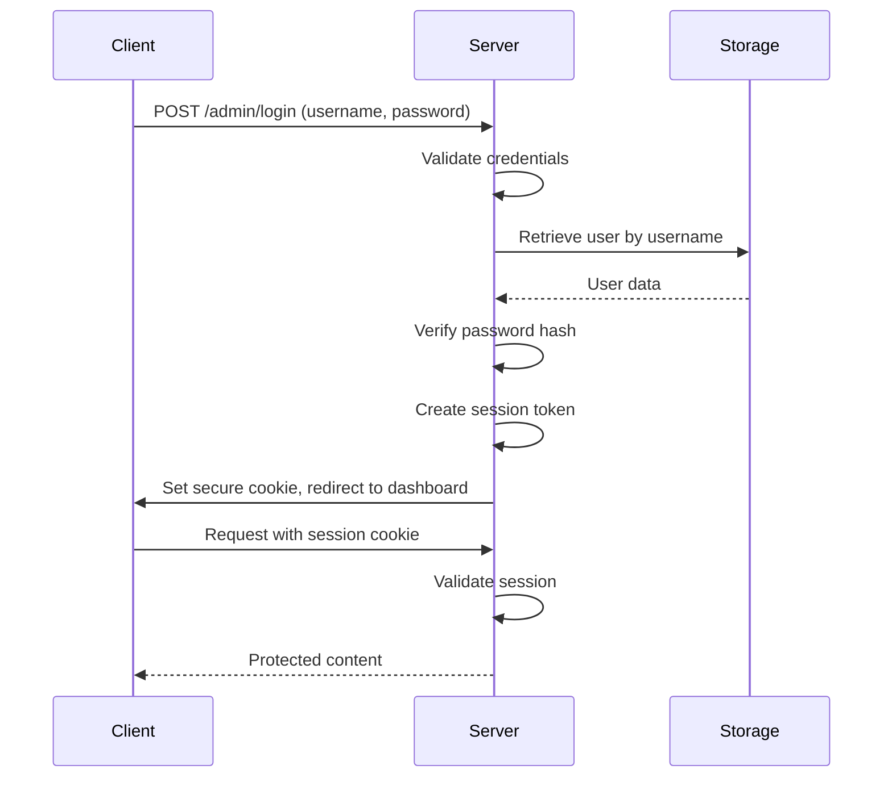

# Dining Hall Dashboard - System Architecture Design

## Overview

Rust-based web application using Actix-web for managing dining hall menu items and site notices with admin authentication.

## Dependencies

- actix-web = "4.11.0"
- serde = { version = "1.0.219", features = ["derive"] }
- tera = "1.20.0"
- argon2 = "0.5.3"
- serde_json = "1.0.108"
- chrono = { version = "0.4.31", features = ["serde"] }
- uuid = { version = "1.7.0", features = ["serde", "v4"] }
- actix-session = "0.8.0"
- rand = "0.8.5"

## Data Models

### MenuItem

```rust
#[derive(Debug, Serialize, Deserialize, Clone)]
pub struct MenuItem {
    pub id: Uuid,
    pub name: String,
    pub category: MenuCategory,
    pub description: String,
    pub price: f64,
    pub allergens: Vec<String>,
    pub is_available: bool,
}

#[derive(Debug, Serialize, Deserialize, Clone)]
pub enum MenuCategory {
    Mains,
    Sides,
    Desserts,
    Beverages,
}
```

### Notice

```rust
#[derive(Debug, Serialize, Deserialize, Clone)]
pub struct Notice {
    pub id: Uuid,
    pub title: String,
    pub content: String,
    pub is_active: bool,
    pub created_at: DateTime<Utc>,
    pub updated_at: DateTime<Utc>,
}
```

### AdminUser

```rust
#[derive(Debug, Serialize, Deserialize)]
pub struct AdminUser {
    pub id: Uuid,
    pub username: String,
    pub password_hash: String,
}
```

## JSON Storage System

### File Paths

- Menu items: `data/menu_items.json`
- Notices: `data/notices.json`
- Admin users: `data/admin_users.json`

### Storage Module Interface

```rust
pub struct JsonStorage {
    menu_items: Mutex<Vec<MenuItem>>,
    notices: Mutex<Vec<Notice>>,
    admin_users: Mutex<Vec<AdminUser>>,
}

impl JsonStorage {
    pub async fn new() -> Result<Self, StorageError> {
        // Initialize and load data from files
    }

    pub async fn save_menu_items(&self) -> Result<(), StorageError> {
        // Thread-safe save operation
    }

    pub async fn get_menu_items(&self) -> Result<Vec<MenuItem>, StorageError> {
        // Thread-safe read operation
    }

    // Similar methods for notices and admin users
}
```

## API Endpoint Specifications

### Menu Items Endpoints

- `GET /api/items` - List all menu items (200 OK)
- `POST /api/items` - Create new menu item (201 Created, 400 Bad Request)
- `PUT /api/items/{id}` - Update menu item (200 OK, 404 Not Found)
- `DELETE /api/items/{id}` - Delete menu item (204 No Content, 404 Not Found)

### Notices Endpoints

- `GET /api/notices` - List all notices (200 OK)
- `POST /api/notices` - Create new notice (201 Created, 400 Bad Request)
- `PUT /api/notices/{id}` - Update notice (200 OK, 404 Not Found)
- `DELETE /api/notices/{id}` - Delete notice (204 No Content, 404 Not Found)

### Authentication Endpoints

- `POST /admin/login` - Handle login (200 OK, 401 Unauthorized)
- `POST /admin/logout` - Handle logout (200 OK)
- `GET /admin/dashboard` - Admin dashboard (200 OK, 403 Forbidden)

## Authentication System

### Session Management

- Secure cookies with HttpOnly and Secure flags
- CSRF protection tokens
- Argon2 password hashing with salt
- Session expiration after 24 hours

### Password Hashing

```rust
pub fn hash_password(password: &str) -> Result<String, Argon2Error> {
    let salt = SaltString::generate(&mut OsRng);
    let argon2 = Argon2::default();
    Ok(argon2.hash_password(password.as_bytes(), &salt)?.to_string())
}
```

## Templating Structure

### Directory Structure

```
templates/
├── base.html
├── menu.html
├── notices.html
├── admin/
│   ├── login.html
│   ├── dashboard.html
│   └── edit_item.html
└── partials/
    ├── header.html
    └── footer.html
```

### Base Template

```html
<!DOCTYPE html>
<html lang="en">
  <head>
    <meta charset="UTF-8" />
    <meta name="viewport" content="width=device-width, initial-scale=1.0" />
    <title>Dining Hall Dashboard</title>
    <link rel="stylesheet" href="/static/css/style.css" />
  </head>
  <body>
    
    <main></main>
    
  </body>
</html>
```

## Frontend Architecture

### Accessibility Features

- WCAG 2.1 AA compliance
- Semantic HTML structure
- ARIA labels for interactive elements
- Keyboard navigation support
- High color contrast ratios (4.5:1 minimum)
- Responsive design for mobile/desktop

### CSS Structure

- Mobile-first responsive design
- CSS Grid and Flexbox layouts
- CSS custom properties for theming
- Minimal JavaScript for enhanced functionality

## Project Structure

```
src/
├── main.rs
├── models.rs
├── storage.rs
├── handlers.rs
├── auth.rs
├── templates.rs
└── routes.rs
data/
├── menu_items.json
├── notices.json
└── admin_users.json
templates/
├── base.html
├── menu.html
├── notices.html
└── admin/
assets/
├── static/
│   ├── css/
│   ├── js/
│   └── images/
└── branding/
```

## Authentication Flow



## Error Handling

- Custom error types for storage, authentication, and validation
- Appropriate HTTP status codes
- User-friendly error messages
- Logging for debugging purposes

## Security Considerations

- Password hashing with Argon2
- Secure cookie settings
- CSRF protection
- Input validation and sanitization
- Rate limiting for authentication endpoints
